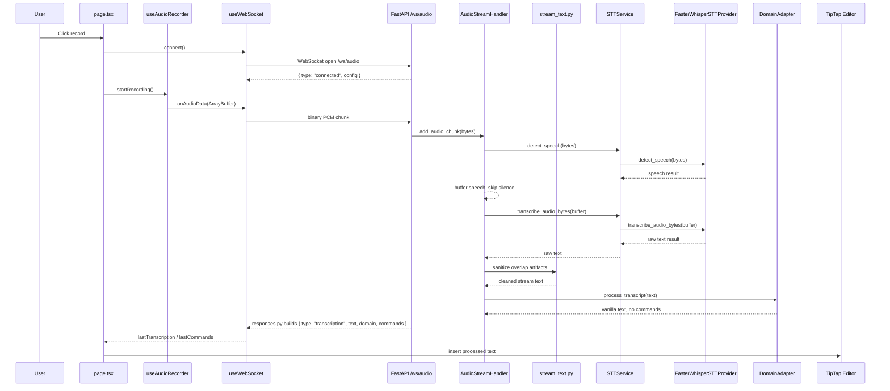
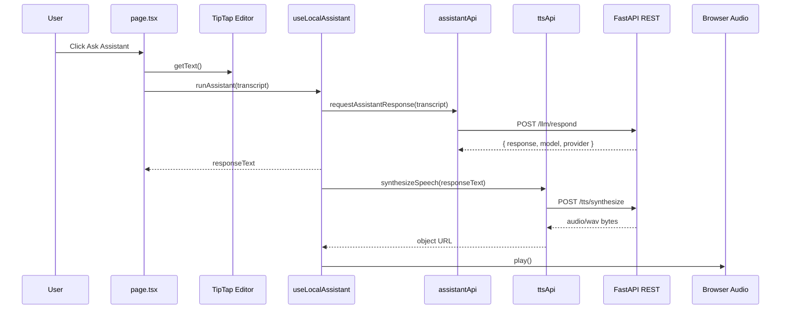
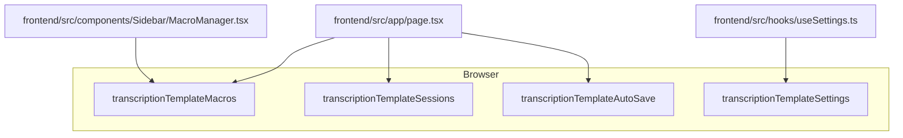

# Architecture Graph: Transcription Template

This file is for AI agents and maintainers. It keeps future changes aligned with the vanilla transcription template.

Durable architecture rationale lives in `docs/adr/`; keep this file focused on current runtime flow and protocol facts.

## System Graph

```mermaid
flowchart LR
  User[User]

  subgraph Frontend["Frontend: Next.js + React"]
    Page["src/app/page.tsx\nMain coordinator"]
    AppConfig["src/lib/appConfig.ts\nBranding, storage keys, wrapper toggles"]
    Constants["src/lib/constants.ts\nAPI_URL / WS_URL / audio constants"]
    Recorder["src/hooks/useAudioRecorder.ts\nMicrophone -> PCM chunks"]
    WS["src/hooks/useWebSocket.ts\nWebSocket client"]
    AssistantHook["src/hooks/useLocalAssistant.ts\nLLM -> TTS orchestration"]
    AssistantPanel["src/components/Assistant/LocalAssistantPanel.tsx\nResponse + playback UI"]
    AssistantAPI["src/services/assistantApi.ts\nPOST /llm/respond client"]
    TTSAPI["src/services/ttsApi.ts\nPOST /tts/synthesize client"]
    VoiceCommands["src/hooks/useVoiceCommands.ts\nLocal commands + snippets"]
    Editor["src/components/Editor/DictationEditor.tsx\nTipTap editor"]
    Sidebar["src/components/Sidebar/*\nSnippets / history"]
    LocalStorage[("Browser localStorage\nsnippets / sessions / settings / autosave")]
  end

  subgraph Backend["Backend: FastAPI"]
    App["backend/app/main.py\nFastAPI app + /ws/audio"]
    Dependencies["backend/app/dependencies.py\nService composition"]
    LLMRoutes["api/llm_routes.py\nPOST /llm/respond"]
    LLMService["services/llm/service.py\nGeneric LLM service boundary"]
    LMStudio["services/llm/lm_studio.py\nLM Studio provider"]
    TTSRoutes["api/tts_routes.py\nPOST /tts/synthesize"]
    TTSService["services/tts/service.py\nGeneric TTS service boundary"]
    SupertonicTTS["services/tts/supertonic.py\nSupertonic 3 provider"]
    Handler["websocket/audio_stream_handler.py\nVAD buffering + flush"]
    WSControl["websocket/control_messages.py\nJSON control messages"]
    WSResponses["websocket/responses.py\nConnection/transcription payloads"]
    StreamText["websocket/stream_text.py\nOverlap text cleanup"]
    Config["backend/app/audio_config.py\nAudio/model/server config"]
    STTService["services/stt/service.py\nGeneric STT service boundary"]
    FasterWhisper["services/stt/faster_whisper.py\nFaster-Whisper + Silero provider"]
    AudioProcessing["services/audio_processing.py\nAudio conversion/preprocessing"]
    TextProcessing["services/transcription_text.py\nHallucination filtering/text cleanup"]
    CudaBootstrap["infrastructure/cuda_bootstrap.py\nWindows CUDA path setup"]
    Domains["domains/*\nRegistry + adapter seam"]
    Commands["services/command_processor.py\nReusable command parser"]
  end

  User --> Page
  Page --> AppConfig
  Page --> Recorder
  Page --> WS
  Page --> AssistantPanel
  Page --> AssistantHook
  Page --> VoiceCommands
  Page --> Editor
  Page --> Sidebar
  Page --> LocalStorage
  Sidebar --> LocalStorage
  Constants --> Page
  Constants --> WS
  Constants --> AssistantAPI
  Constants --> TTSAPI
  AssistantPanel --> AssistantHook
  AssistantHook --> AssistantAPI
  AssistantHook --> TTSAPI
  AssistantAPI -- "http://.../llm/respond" --> App
  TTSAPI -- "http://.../tts/synthesize" --> App

  Recorder -- "binary PCM audio chunks" --> WS
  WS -- "ws://.../ws/audio" --> App
  App --> Handler
  App --> Dependencies
  App --> LLMRoutes
  LLMRoutes --> Dependencies
  LLMRoutes --> LLMService
  LLMService --> LMStudio
  LLMRoutes --> Config
  App --> TTSRoutes
  TTSRoutes --> Dependencies
  TTSRoutes --> TTSService
  TTSService --> SupertonicTTS
  TTSRoutes --> Config
  App --> WSControl
  App --> WSResponses
  Handler --> Config
  Handler --> STTService
  Handler --> StreamText
  Handler --> Domains
  WSControl --> Handler
  STTService --> FasterWhisper
  Dependencies --> STTService
  Dependencies --> LLMService
  Dependencies --> TTSService
  FasterWhisper --> AudioProcessing
  FasterWhisper --> TextProcessing
  FasterWhisper --> CudaBootstrap
  Domains --> Commands
  WSResponses --> Domains
  FasterWhisper --> Config
  App -- "JSON transcription events" --> WS
  WS --> Page
  VoiceCommands --> Editor
  Page --> Editor
```



## Runtime Sequence



## Local Assistant Sequence



The local assistant REST flow is independent of `/ws/audio`.

## Protocol Facts

WebSocket endpoint:

```text
/ws/audio
```

Client to server:

```text
Binary message: raw 16-bit PCM audio, 16 kHz, mono
Text message: JSON control command
```

Common client JSON control messages:

```json
{ "type": "ping" }
{ "type": "flush" }
{ "type": "reset" }
{ "type": "stats" }
{ "type": "enable_commands" }
{ "type": "disable_commands" }
{ "type": "get_commands" }
{ "type": "register_command", "pattern": "my phrase", "replacement": "expanded text", "action": "custom_action" }
```

Server to client:

```json
{ "type": "connected", "message": "...", "config": {} }
{ "type": "transcription", "text": "...", "domain": "general", "commands": [], "is_final": true, "processing_time_ms": 123.4, "audio_duration_seconds": 1.2, "flush_reason": "natural_pause" }
{ "type": "control_ack", "action": "flush" }
{ "type": "available_commands", "commands_list": {} }
{ "type": "stats", "data": {} }
{ "type": "error", "message": "...", "code": "..." }
{ "type": "pong", "timestamp": "..." }
```

REST endpoints:

```text
GET /
GET /health
GET /config
POST /llm/respond
POST /tts/synthesize
```

`POST /llm/respond` accepts `{ "text": "...", "system_prompt": "..." }`, delegates through the backend LLM service boundary to the configured LM Studio provider, calls LM Studio's OpenAI-compatible `/chat/completions` endpoint, and returns `{ "response": "...", "model": "...", "provider": "lmstudio" }`. It is independent of `/ws/audio` and does not alter the transcription pipeline.

`POST /tts/synthesize` accepts `{ "text": "...", "voice": "M1", "lang": "en" }`, delegates through the backend TTS service boundary to the configured Supertonic provider, and returns playable `audio/wav` bytes. It is independent of `/ws/audio`, STT, and the LM Studio flow.

## Persistence Graph



## Architecture Rules

- Keep `/ws/audio` synchronized across backend, frontend constants, README/docs, and this graph.
- Keep audio format assumptions synchronized across `useAudioRecorder.ts`, `audio_config.py`, and `AudioStreamHandler`.
- Keep backend WebSocket buffering in `backend/app/websocket/audio_stream_handler.py`, control message handling in `backend/app/websocket/control_messages.py`, and response payload construction in `backend/app/websocket/responses.py`.
- Keep streaming overlap text cleanup in `backend/app/websocket/stream_text.py`; `AudioStreamHandler` should coordinate it rather than own the cleanup internals.
- Keep Windows CUDA path setup centralized in `backend/app/infrastructure/cuda_bootstrap.py`.
- Keep audio conversion/preprocessing in `backend/app/services/audio_processing.py` and transcription text cleanup in `backend/app/services/transcription_text.py`.
- Keep STT orchestration in `backend/app/services/stt/service.py`, service construction in `backend/app/dependencies.py`, and Faster-Whisper/Silero provider logic in `backend/app/services/stt/faster_whisper.py`.
- Keep the built-in domain vanilla. Add domain-specific behavior through registered wrapper adapters rather than editing STT provider logic.
- Keep the LM Studio REST integration in `backend/app/api/llm_routes.py`, `backend/app/dependencies.py`, `backend/app/services/llm/service.py`, and `backend/app/services/llm/lm_studio.py`; do not route it through `/ws/audio`.
- Keep the Supertonic TTS integration in `backend/app/api/tts_routes.py`, `backend/app/dependencies.py`, `backend/app/services/tts/service.py`, and `backend/app/services/tts/supertonic.py`; do not route it through `/ws/audio`.
- Keep frontend assistant API calls in `frontend/src/services/assistantApi.ts` and `frontend/src/services/ttsApi.ts`; do not add REST assistant logic to WebSocket or recorder hooks.
- Keep frontend wrapper branding and feature toggles in `frontend/src/lib/appConfig.ts`.
- Keep user-local snippets/sessions/settings/autosave in localStorage unless a backend storage change is explicitly requested.
- If adding a new cross-boundary message, document its JSON shape here.

## Last Updated Notes

- 2026-05-26: Removed built-in domain-specific formatter/template storage and documented the vanilla wrapper-ready runtime.
- 2026-05-30: Split backend WebSocket audio pipeline internals into focused `backend/app/websocket/` modules while keeping `/ws/audio` in `backend/app/main.py`.
- 2026-05-30: Centralized backend CUDA bootstrap and split audio/text helper responsibilities out of the STT implementation.
- 2026-05-30: Added backend-only `POST /llm/respond` for LM Studio responses, separate from the WebSocket transcription flow.
- 2026-05-30: Added backend-only `POST /tts/synthesize` for Supertonic 3 `audio/wav` synthesis, separate from STT and the WebSocket transcription flow.
- 2026-05-30: Added frontend Local Assistant flow from editor text to LM Studio response to Supertonic WAV playback.
- 2026-05-31: Refactored backend LM Studio and Supertonic integrations into reusable LLM/TTS service/provider boundaries without changing REST endpoint behavior.
- 2026-06-01: Refactored backend STT into a reusable service/provider boundary with Faster-Whisper/Silero as the provider, preserving `/ws/audio` behavior.
- 2026-06-01: Added centralized backend service composition, map-based domain registration for available-domain metadata, typed STT result contracts, and focused streaming text cleanup helpers without changing public endpoint or WebSocket contracts.
