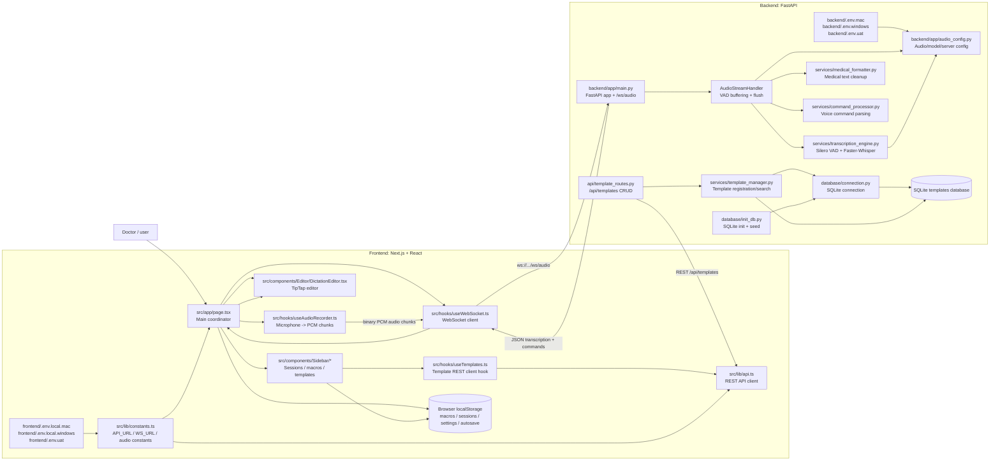
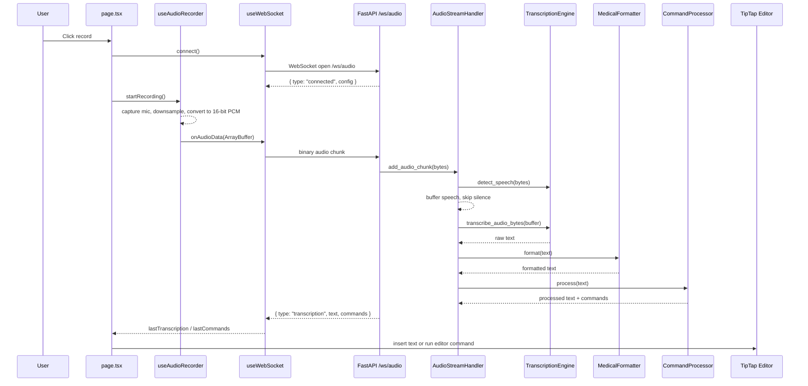
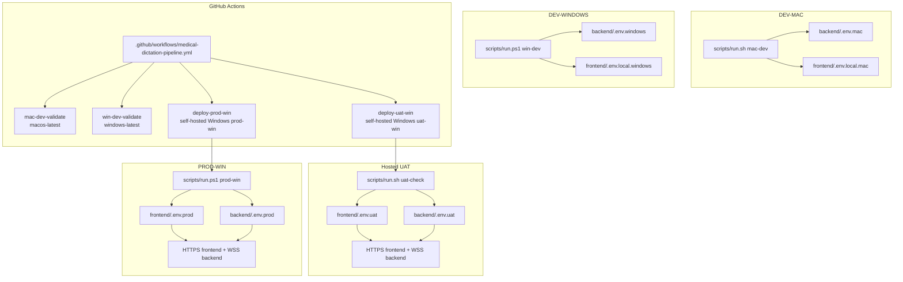
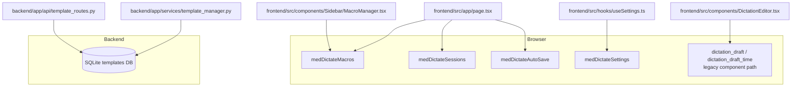

# Architecture Graph: Medical Dictation

This file is for AI agents and maintainers. It exists to reduce context, prevent hallucinated architecture, and keep future changes aligned with the current project shape.

## Context Budget

For most AI coding tasks, read only:

1. `AI_CONTEXT.md`
2. `ENVIRONMENTS.md` for setup, deployment, platform, URL, or CORS work
3. The specific files listed for the requested change
4. This file only if the request touches architecture, protocol, storage, or cross-cutting behavior

Avoid loading unrelated UI components, generated files, lockfiles, or dependency folders unless the task requires them.

## System Graph



## Runtime Sequence



## Backend Responsibilities

`backend/app/main.py`

- Creates FastAPI app.
- Loads database, audio config, Whisper/VAD engine, and template manager during lifespan startup.
- Exposes REST endpoints `/`, `/health`, `/config`.
- Exposes WebSocket endpoint `/ws/audio`.
- Defines `AudioStreamHandler`, which owns per-connection audio buffering and command processing.
- Registers active SQLite templates on each session command processor so spoken template triggers work over WebSocket.

`backend/app/services/transcription_engine.py`

- Loads Silero VAD if available.
- Loads Faster-Whisper model.
- Detects speech from PCM bytes; chunks larger than Silero's 512-sample 16kHz model window are framed internally before scoring.
- Transcribes audio bytes.
- Returns structured dicts instead of letting transcription failures crash the WebSocket loop.

`backend/app/services/medical_formatter.py`

- Converts common spoken numbers/units.
- Normalizes medical acronyms.
- Capitalizes drug names and sentences.
- Cleans whitespace.

`backend/app/services/command_processor.py`

- Parses voice commands.
- Handles punctuation commands like "period" and "new line".
- Handles editing/navigation/control/template/custom commands.
- Maintains per-handler command history.

`backend/app/api/template_routes.py`

- Provides CRUD/search/stats/test/refresh/export endpoints for templates.
- Mounted in `main.py` with prefix `/api`, so template routes live under `/api/templates`.

## Frontend Responsibilities

`frontend/src/app/page.tsx`

- Main UI coordinator.
- Starts/stops recording.
- Owns editor ref and session state.
- Wires audio recorder to WebSocket binary sending.
- Processes incoming transcriptions and command events; transcription text is queued as one-shot editor insertion events and cleared after consumption.
- Persists sessions/macros/autosave in localStorage.

`frontend/src/hooks/useAudioRecorder.ts`

- Requests microphone access.
- Captures browser audio.
- Downsamples to expected sample rate.
- Converts Float32 audio to 16-bit PCM.
- Emits `ArrayBuffer` chunks through `onAudioData`.

`frontend/src/hooks/useWebSocket.ts`

- Opens WebSocket connection.
- Sends binary audio.
- Sends JSON control messages: `flush`, `reset`, `stats`, command enable/disable, custom command registration.
- Parses JSON messages from backend.
- Tracks connection state, last transcription, and command metadata.

`frontend/src/lib/constants.ts`

- Defines `WS_URL`, `API_URL`, audio sample rate, chunk interval, autosave interval, session limit, and toast duration.
- Reads frontend URLs from `NEXT_PUBLIC_API_URL` and `NEXT_PUBLIC_WS_URL`.
- Automatically preserves `/ws/audio` for WebSocket URLs.

`frontend/src/lib/api.ts` and `frontend/src/hooks/useTemplates.ts`

- Call backend REST template endpoints.
- Use `API_URL` from constants.

## Protocol Facts

WebSocket endpoint:

```text
/ws/audio
```

Client to server:

```text
Binary message: raw 16-bit PCM audio, 16kHz, mono
Text message: JSON control command
```

Common client JSON control messages:

```json
{ "type": "ping" }
{ "type": "flush" }
{ "type": "reset" }
{ "type": "stats" }
{ "type": "enable_commands" }
{ "type": "disable_commands" }
{ "type": "get_commands" }
{ "type": "register_command", "pattern": "my phrase", "replacement": "expanded text", "action": "custom_action" }
```

Server to client:

```json
{ "type": "connected", "message": "...", "config": {} }
{ "type": "transcription", "text": "...", "commands": [], "is_final": true }
{ "type": "control_ack", "action": "flush" }
{ "type": "available_commands", "commands_list": {} }
{ "type": "stats", "data": {} }
{ "type": "error", "message": "...", "code": "..." }
{ "type": "pong", "timestamp": "..." }
```

REST endpoints:

```text
GET    /
GET    /health
GET    /config
GET    /api/templates/
GET    /api/templates/categories
GET    /api/templates/stats
GET    /api/templates/triggers
GET    /api/templates/{name}
POST   /api/templates/
PUT    /api/templates/{name}
DELETE /api/templates/{name}
POST   /api/templates/bulk-import
GET    /api/templates/export/all
POST   /api/templates/test
POST   /api/templates/refresh
```

## Environment Graph



Environment rules:

- DEV-MAC uses `scripts/run.sh mac-dev`.
- DEV-WINDOWS uses `scripts/run.ps1 win-dev`.
- UAT uses environment-specific deployment values, `scripts/run.sh uat-check` for validation, and `scripts/run.ps1 uat-win` for hosted Windows deployment.
- PROD-WIN uses environment-specific deployment values and `scripts/run.ps1 prod-win`.
- Frontend URLs must come from `NEXT_PUBLIC_API_URL` and `NEXT_PUBLIC_WS_URL`.
- Backend CORS origins must come from `CORS_ORIGINS`.
- Temporary tunnel URLs must not be committed into source constants.
- UAT and Production deployments require self-hosted Windows GitHub Actions runners.

## Persistence Graph



## Architecture Rules

- Keep the WebSocket endpoint name synchronized across backend, frontend constants, README/docs, and this graph.
- Keep environment files synchronized with `ENVIRONMENTS.md`.
- Keep audio format assumptions synchronized across `useAudioRecorder.ts`, `audio_config.py`, and `AudioStreamHandler`.
- Keep backend command action names synchronized with frontend command handling in `page.tsx`.
- Keep template CRUD in backend REST routes and template manager. Do not create a separate frontend-only template source of truth unless explicitly requested.
- Keep user-local macros/sessions/settings/autosave in localStorage unless a migration to backend storage is explicitly requested.
- Prefer extending existing service classes over adding parallel logic.
- If adding a new cross-boundary message, document its JSON shape here.

## Change Checklist

When changing audio:

- Update `frontend/src/hooks/useAudioRecorder.ts`.
- Update `backend/app/audio_config.py`.
- Update backend buffering/transcription assumptions in `backend/app/main.py`.
- Update protocol facts in this file.

When changing environments:

- Update `ENVIRONMENTS.md`.
- Update the relevant `.env.*` files.
- Update `scripts/run.sh` or `scripts/run.ps1` if startup behavior changes.
- Update `.github/workflows/medical-dictation-pipeline.yml` and `scripts/run.ps1` if deployment behavior changes.
- Update `AI_CONTEXT.md` if future AI sessions need to know the change.

When changing WebSocket behavior:

- Update `backend/app/main.py`.
- Update `frontend/src/hooks/useWebSocket.ts`.
- Update caller behavior in `frontend/src/app/page.tsx`.
- Update message examples in this file.

When changing voice commands:

- Update `backend/app/services/command_processor.py`.
- If the command affects UI/editor behavior, update `frontend/src/app/page.tsx`.
- Update command docs/examples in this file.

When changing templates:

- Update `backend/app/services/template_manager.py` and/or `backend/app/api/template_routes.py`.
- Update frontend template hooks/components if user-facing.
- Update REST endpoint docs if routes change.

When changing editor behavior:

- Update `frontend/src/components/Editor/DictationEditor.tsx`.
- Update `frontend/src/app/page.tsx` if insertion or command execution changes.

## Known Context Traps

- `frontend/src/components/DictationEditor.tsx` appears to be an older/alternate dictation component. The current main page imports `frontend/src/components/Editor/DictationEditor.tsx`.
- `README.md` may mention older endpoint names in some places. Verify against `backend/app/main.py`.
- `frontend/src/lib/constants.ts` must stay environment-driven. Do not reintroduce hardcoded tunnel URLs.
- There are two layers of command processing: backend `CommandProcessor` and frontend `useVoiceCommands`. Check both before changing command behavior.
- Do not assume a backend user/session database exists. Most note/session state is localStorage.
