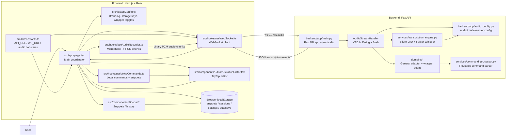
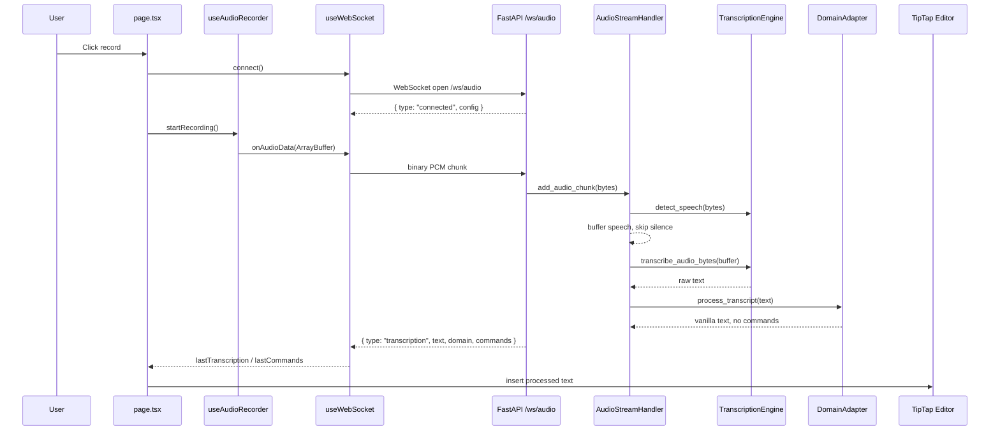
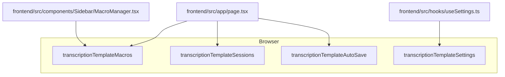

# Architecture Graph: Transcription Template

This file is for AI agents and maintainers. It keeps future changes aligned with the vanilla transcription template.

## System Graph



## Runtime Sequence



## Protocol Facts

WebSocket endpoint:

```text
/ws/audio
```

Client to server:

```text
Binary message: raw 16-bit PCM audio, 16 kHz, mono
Text message: JSON control command
```

Common client JSON control messages:

```json
{ "type": "ping" }
{ "type": "flush" }
{ "type": "reset" }
{ "type": "stats" }
{ "type": "enable_commands" }
{ "type": "disable_commands" }
{ "type": "get_commands" }
{ "type": "register_command", "pattern": "my phrase", "replacement": "expanded text", "action": "custom_action" }
```

Server to client:

```json
{ "type": "connected", "message": "...", "config": {} }
{ "type": "transcription", "text": "...", "domain": "general", "commands": [], "is_final": true, "processing_time_ms": 123.4, "audio_duration_seconds": 1.2, "flush_reason": "natural_pause" }
{ "type": "control_ack", "action": "flush" }
{ "type": "available_commands", "commands_list": {} }
{ "type": "stats", "data": {} }
{ "type": "error", "message": "...", "code": "..." }
{ "type": "pong", "timestamp": "..." }
```

REST endpoints:

```text
GET /
GET /health
GET /config
```

## Persistence Graph



## Architecture Rules

- Keep `/ws/audio` synchronized across backend, frontend constants, README/docs, and this graph.
- Keep audio format assumptions synchronized across `useAudioRecorder.ts`, `audio_config.py`, and `AudioStreamHandler`.
- Keep the built-in domain vanilla. Add domain-specific behavior through wrapper adapters rather than editing `TranscriptionEngine`.
- Keep frontend wrapper branding and feature toggles in `frontend/src/lib/appConfig.ts`.
- Keep user-local snippets/sessions/settings/autosave in localStorage unless a backend storage change is explicitly requested.
- If adding a new cross-boundary message, document its JSON shape here.

## Last Updated Notes

- 2026-05-26: Removed built-in domain-specific formatter/template storage and documented the vanilla wrapper-ready runtime.
