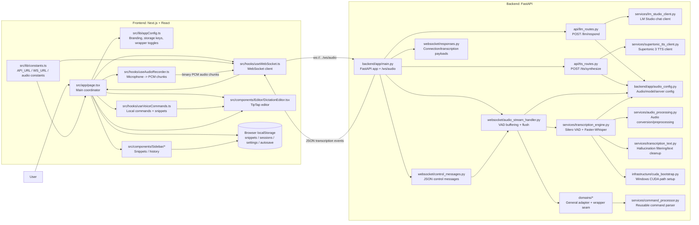
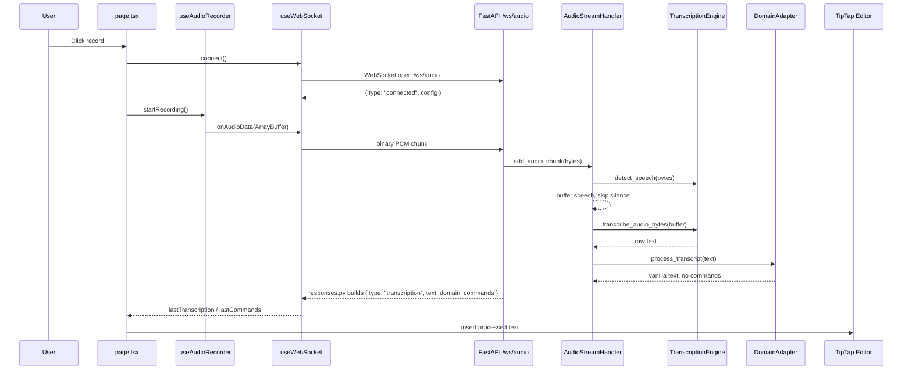
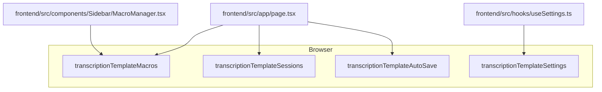

# Architecture Graph: Transcription Template

This file is for AI agents and maintainers. It keeps future changes aligned with the vanilla transcription template.

Durable architecture rationale lives in `docs/adr/`; keep this file focused on current runtime flow and protocol facts.

## System Graph



## Runtime Sequence



## Protocol Facts

WebSocket endpoint:

```text
/ws/audio
```

Client to server:

```text
Binary message: raw 16-bit PCM audio, 16 kHz, mono
Text message: JSON control command
```

Common client JSON control messages:

```json
{ "type": "ping" }
{ "type": "flush" }
{ "type": "reset" }
{ "type": "stats" }
{ "type": "enable_commands" }
{ "type": "disable_commands" }
{ "type": "get_commands" }
{ "type": "register_command", "pattern": "my phrase", "replacement": "expanded text", "action": "custom_action" }
```

Server to client:

```json
{ "type": "connected", "message": "...", "config": {} }
{ "type": "transcription", "text": "...", "domain": "general", "commands": [], "is_final": true, "processing_time_ms": 123.4, "audio_duration_seconds": 1.2, "flush_reason": "natural_pause" }
{ "type": "control_ack", "action": "flush" }
{ "type": "available_commands", "commands_list": {} }
{ "type": "stats", "data": {} }
{ "type": "error", "message": "...", "code": "..." }
{ "type": "pong", "timestamp": "..." }
```

REST endpoints:

```text
GET /
GET /health
GET /config
POST /llm/respond
POST /tts/synthesize
```

`POST /llm/respond` accepts `{ "text": "...", "system_prompt": "..." }`, calls the configured LM Studio OpenAI-compatible `/chat/completions` endpoint, and returns `{ "response": "...", "model": "...", "provider": "lmstudio" }`. It is independent of `/ws/audio` and does not alter the transcription pipeline.

`POST /tts/synthesize` accepts `{ "text": "...", "voice": "M1", "lang": "en" }`, calls Supertonic 3 through the backend TTS service, and returns playable `audio/wav` bytes. It is independent of `/ws/audio`, STT, and the LM Studio flow.

## Persistence Graph



## Architecture Rules

- Keep `/ws/audio` synchronized across backend, frontend constants, README/docs, and this graph.
- Keep audio format assumptions synchronized across `useAudioRecorder.ts`, `audio_config.py`, and `AudioStreamHandler`.
- Keep backend WebSocket buffering in `backend/app/websocket/audio_stream_handler.py`, control message handling in `backend/app/websocket/control_messages.py`, and response payload construction in `backend/app/websocket/responses.py`.
- Keep Windows CUDA path setup centralized in `backend/app/infrastructure/cuda_bootstrap.py`.
- Keep audio conversion/preprocessing in `backend/app/services/audio_processing.py` and transcription text cleanup in `backend/app/services/transcription_text.py`.
- Keep the built-in domain vanilla. Add domain-specific behavior through wrapper adapters rather than editing `TranscriptionEngine`.
- Keep the LM Studio REST integration in `backend/app/api/llm_routes.py` and `backend/app/services/lm_studio_client.py`; do not route it through `/ws/audio`.
- Keep the Supertonic TTS integration in `backend/app/api/tts_routes.py` and `backend/app/services/supertonic_tts_client.py`; do not route it through `/ws/audio`.
- Keep frontend wrapper branding and feature toggles in `frontend/src/lib/appConfig.ts`.
- Keep user-local snippets/sessions/settings/autosave in localStorage unless a backend storage change is explicitly requested.
- If adding a new cross-boundary message, document its JSON shape here.

## Last Updated Notes

- 2026-05-26: Removed built-in domain-specific formatter/template storage and documented the vanilla wrapper-ready runtime.
- 2026-05-30: Split backend WebSocket audio pipeline internals into focused `backend/app/websocket/` modules while keeping `/ws/audio` in `backend/app/main.py`.
- 2026-05-30: Centralized backend CUDA bootstrap and split audio/text helper responsibilities out of `TranscriptionEngine`.
- 2026-05-30: Added backend-only `POST /llm/respond` for LM Studio responses, separate from the WebSocket transcription flow.
- 2026-05-30: Added backend-only `POST /tts/synthesize` for Supertonic 3 `audio/wav` synthesis, separate from STT and the WebSocket transcription flow.
